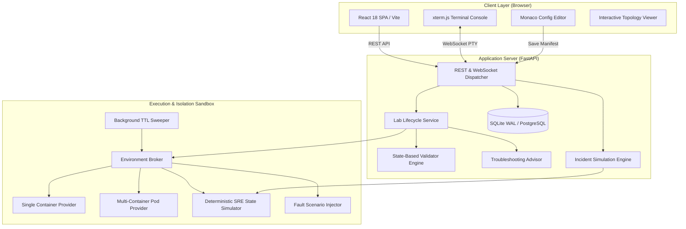

# KubeLabs System Architecture & Component Interactions

## 1. High-Level Architecture Overview
KubeLabs is architected as a high-performance **modular monolith** with clear boundary separation across its frontend client, backend API gateway, and sandbox execution layers.

## 2. Component Deconstruction

### 2.1 Frontend Client (`apps/web`)
- **Technology**: React 18, TypeScript, Vite, Monaco Editor, xterm.js, Lucide Icons.
- **State Management**: Localized state with lightweight context providers for active sandbox session and incident state.
- **Workspace Layout**: Split-pane responsive layout separating instructions, configuration editor, architecture topology, interactive terminal, telemetry streams, validation results, and interactive `SkillGraph` for tracking 24 competency paths.

### 2.2 Backend Modular Monolith (`apps/api`)
- **Technology**: Python 3.11, FastAPI, SQLAlchemy ORM, PostgreSQL connection pool (`pool_size=20`) with SQLite WAL fallback, Redis sliding-window rate limiter, Pydantic v2.
- **WebSocket Terminal Streamer**: Bi-directional PTY handler connecting the browser xterm.js instance with a 1000-line scrollback buffer for resilient reconnection replay.
- **REST APIs**: Versioned under `/api/v1` (`/labs`, `/incidents`, `/assessments`, `/dashboard`, `/telemetry`).

### 2.3 Domain Packages (`packages/`)
- `packages/lab_schema`: Strict Pydantic models, registry loader, and `ScenarioFactory` generating failure scenarios across all 24 tracks.
- `packages/validator_core`: 15 state-based verification engines checking system final state across containers, hosts, and simulated environments.
- `packages/sandbox_runtime`: `EnvironmentBroker`, `SingleContainerProvider`, `MultiContainerPodProvider`, `ScenarioInjector`, `PodmanSandboxExecutor`, and `DeterministicSimulator`.
- `packages/incident_core`: SEV-1/SEV-2 cascading outage scenarios, canonical 6-tier microservices topology, distributed trace generator, and automated Markdown post-mortem engine.

## 3. Data Flow & Execution Lifecycles

### 3.1 Lab Session Initiation
1. Learner clicks "Start Lab" on `/labs/linux-inode-exhaustion`.
2. Client sends `POST /api/v1/labs/linux-inode-exhaustion/session`.
3. Backend checks if Podman engine is operational:
   - If available: Spawns rootless container with `cap-drop=ALL`, stages initial files, and runs failure injection script.
   - If in simulation mode: Instantiates `DeterministicSimulator` with seed data.
4. Returns session ID and expiration timestamp to client.
5. Client mounts xterm.js terminal and connects to `/ws/terminal/{sessionId}`.

### 3.2 State-Based Validation Workflow
1. Learner executes diagnostic commands and remediations in terminal or saves configuration in Monaco editor.
2. Learner clicks "Run State Validation".
3. Client issues `POST /api/v1/labs/session/{sessionId}/validate` with target task ID.
4. `ValidatorEngine` evaluates declared rules against container or simulator state:
   - Evaluates file contents, socket listening ports, YAML assertions, process lists, or metric thresholds.
5. Produces `ValidationReport` (`PASS`, `PARTIAL`, `FAIL`) with exact score and actionable feedback.
